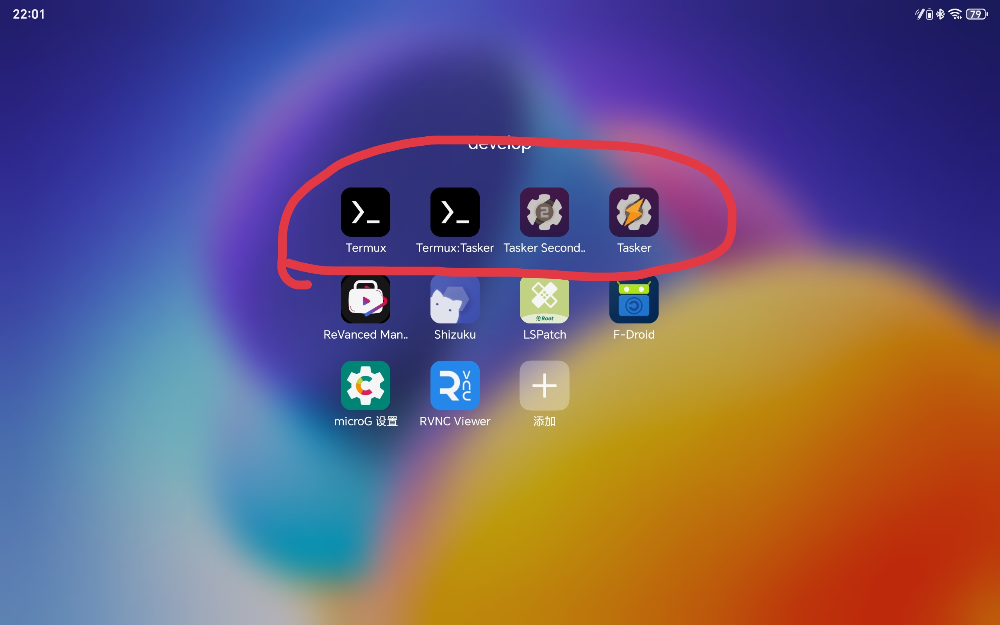

# 由于图书馆一天三次签到繁琐不利于考研，故在我考研期间写了此脚本，并在考研结束后25年一月五号完成app版本。
## python版本
为了实现在手机端自动签到需要软件termux（用于执行python文件）
Tasker（用于手机定时任务）
Termux:Tasker（用于tasker控制termux）
termux和tasker都可在谷歌商店下载，tasker付费20元左右（超级好用）
termux调用tasker需要给与权限（荣耀反正是需要ADB授权权限）软件如图：

权限弄好后再tasker里填执行时间和运行文件即可（问ChatGPT）

## java编写的安卓版本直接填参数使用即可
unionID是微信的，类似令牌，平时扫码签到靠这个标识用户
辅助账号用来抢占位置，一般上午使用时不能预约下午的，可用辅助账号先占位预约，主账号签退时会让辅助账号取消预约，主账号再预约。
有问题可以在issue里提。

